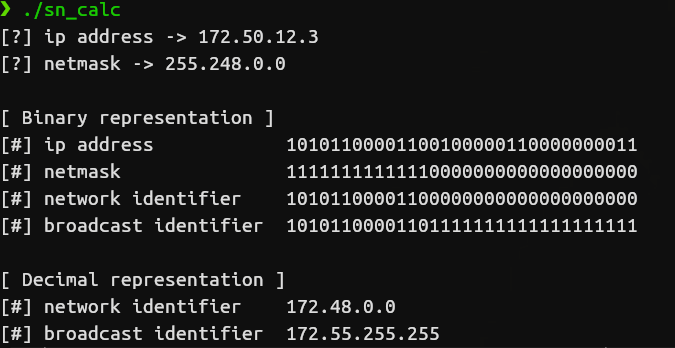

# Ipv4 subnetting calculator
This is a tool for network/sys admins that don't want to go to websites or calculate the network range by hand.

## Why terminal based?
I am a terminal lover, and I like to create terminal software to make my work easier, this is also a practise for me to learn more of the c language, so possibly is not wrote in the most correct way, because I'm still learning c.

**but works:**

**If you find any bug or any part of the code can be wrote in a more correct way pls let me know :)**

