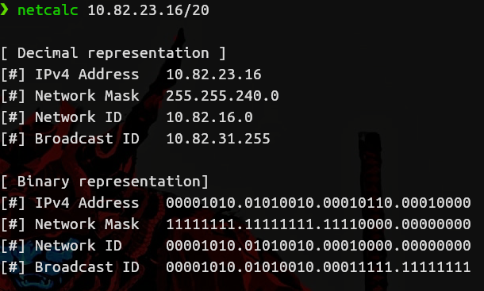
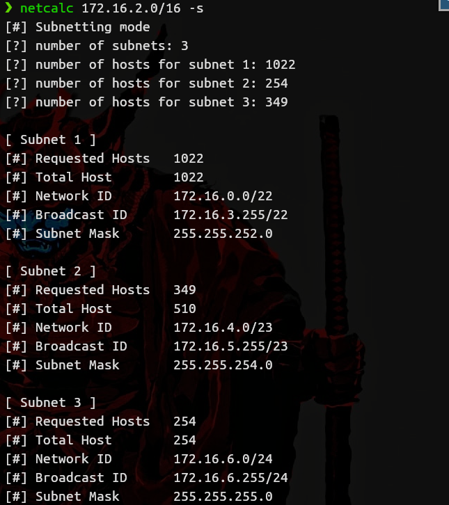

# Ipv4 subnetting calculator
This is a tool for network/sys admins who don't want to calculate the network range or subnets by hand and don't want to visit a website to get the job done.

## Why terminal based?
I am a terminal lover, and I like to create terminal software to make my work easier, this is also practise for me to learn more of the C programming language.

## How to compile it?

```bash
gcc ./src/netcalc.c -o netcalc
```
## Preview - normal mode


## Preview - subnetting mode

