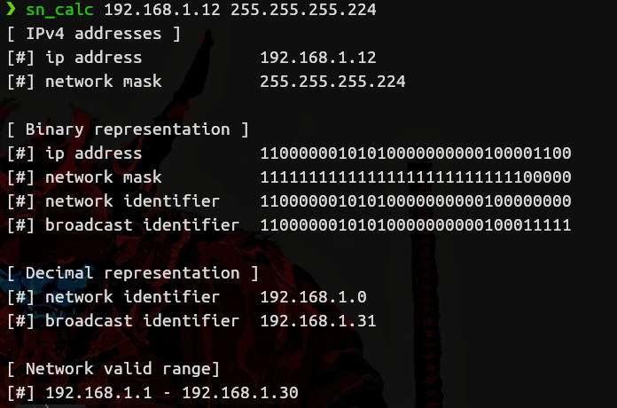

# Ipv4 subnetting calculator
This is a tool for network/sys admins that don't want to go to websites or calculate the network range by hand.

## Why terminal based?
I am a terminal lover, and I like to create terminal software to make my work easier, this is also a practise for me to learn more of the c language, so possibly is not wrote in the most correct way, because I'm still learning c.

## How to compile it?
You will need to link the math library, the rest is a normal compilation

**Example:**

```bash
gcc subnetting_calculator.c -o sn_calc -lm
```

## Preview:


### Without command-line arguments:
**You will write the arguments where there is a [?]**


### With command-line arguments:





