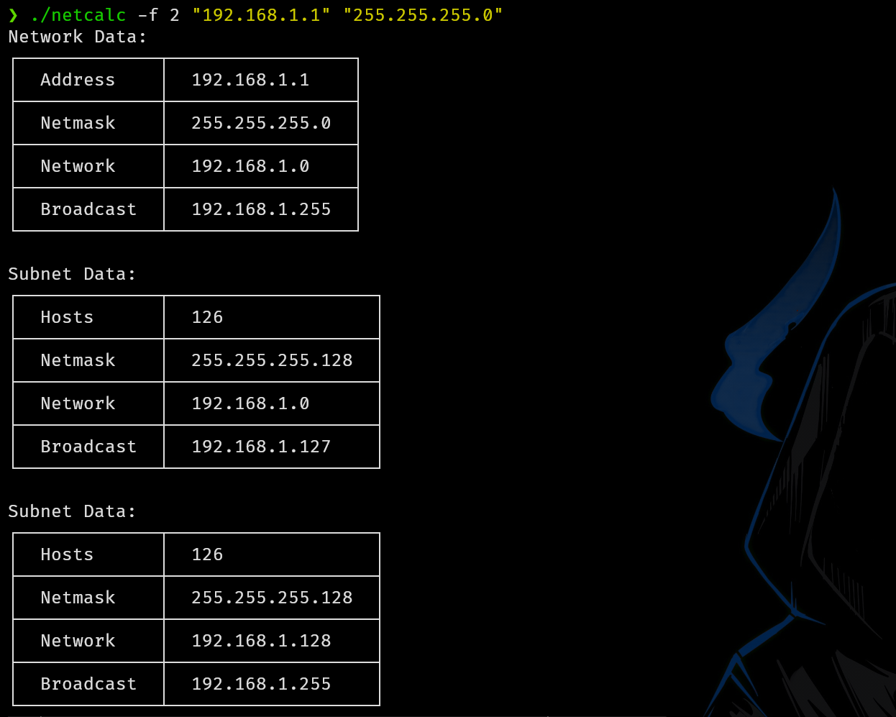
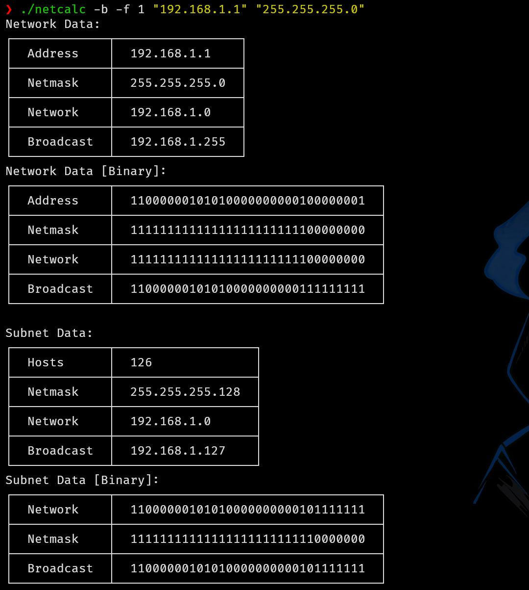

# Netcalc - Network Calculator
Netcalc is a powerful command-line tool for network calculations, supporting both Fixed-Length Subnet Masking (FLSM) and Variable-Length Subnet Masking (VLSM). It allows users to calculate network ranges, subnet divisions, and binary representations of IP addresses.

## How to Use Netcalc

### Basic Usage

```
netcalc [OPTIONS] [MODE] <IP_ADDRESS> <NETMASK>

Modes

    -f, --flsm (Fixed-Length Subnet Masking): Divides a network into subnets of equal size. Requires the number of subnets as an additional parameter.
    -v, --vlsm (Variable-Length Subnet Masking): Allows flexible subnetting based on host requirements. No additional parameters required.

Other Options

    -h, --help: Displays help information.
    -b, --binary: Shows binary representationk.

Examples

    netcalc 192.168.1.0 255.255.255.0 → Calculates network range.
    netcalc 10.15.100.5 255.224.0.0 → Calculates network range for another IP.
    netcalc -f 4 192.168.1.0 255.255.255.0 → Performs FLSM with 4 subnets.
    netcalc -f 4 -b 192.168.1.0 255.255.255.0 → Performs FLSM with 4 subnets showing binary representation as well.
    netcalc -v 192.168.1.0 255.255.255.0 → Performs VLSM subnetting.
```
## CTable - Custom ASCII Table Library  

This project uses **CTable**, a lightweight and efficient open-source library that I developed for generating ASCII-printable tables. **CTable** simplifies the creation of structured text-based tables, making network calculations more readable.  

Check out the project on [GitHub](https://github.com/Letder40/ctable) to explore its features or contribute!  

### Tables




## Compilation
1. Using Build Script

```bash
bash build.sh
```

2. Manual Compilation with CMake

If you prefer manual compilation, follow these steps:

+ Create a build directory: ``mkdir build && cd build``
+ Run ``cmake ..``
+ Compile the program with ``make``

This will generate the netcalc executable inside the build directory.

## Contributing
Feel free to contribute improvements, report issues, or suggest new features. Fork the repository, make your changes, and submit a pull request!
